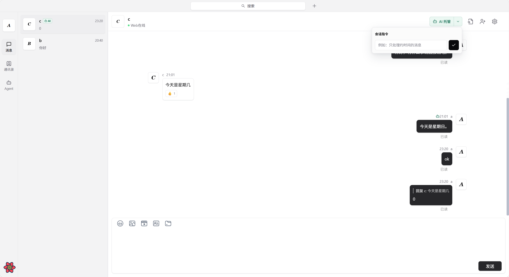
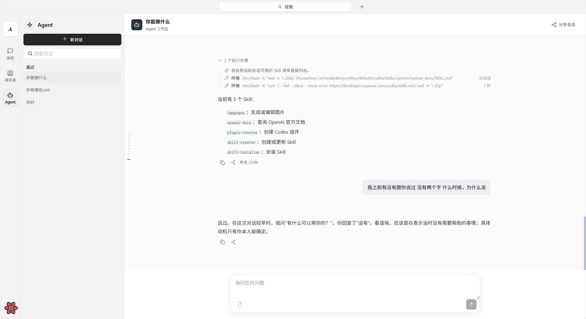

<p align="center">
  
</p>

<h1 align="center">ABD IM Web</h1>

<p align="center">
  ABD IM Web 客户端，提供即时通信、AI 托管和本地 Agent 工作区。
</p>

<p align="center">
  <a href="./README.md">English</a> | 简体中文
</p>

## 界面

### 消息与 AI 托管

AI 托管可以让已配置的 Agent 处理选定的私聊，并将回复保留在原会话中。

<p align="center">
  
</p>

### Agent 工作区

Agent 工作区提供独立会话，用于与本机连接的 Agent 协作。

<p align="center">
  
</p>

## 功能

- 私聊和群聊、联系人、消息记录、搜索、转发、回应和已读状态。
- 为选定私聊开启 AI 托管，并支持每个会话单独设置指令。
- 独立 Agent 工作区，支持流式回复和工具执行过程展示。

AI 功能需要配合 [ABD IM CLI](https://github.com/abd-im/abd-im-cli) 使用；消息功能需要兼容的 ABD IM 服务端和业务服务。

## 相关仓库

- [abd-im-cli](https://github.com/abd-im/abd-im-cli)：连接本地 Agent 与 ABD IM。
- [abd-im-server](https://github.com/abd-im/abd-im-server)：IM 服务端。
- [abd-im-chat](https://github.com/abd-im/abd-im-chat)：账号与业务 API。
- [abd-im-sdk-core](https://github.com/abd-im/abd-im-sdk-core)：跨平台 IM SDK 核心。
- [abd-im-sdk-js-wasm](https://github.com/abd-im/abd-im-sdk-js-wasm)：浏览器 SDK。

## 开发

### 环境要求

- Node.js 18.12 或更高版本
- pnpm
- 已运行的 ABD IM 服务端和业务 API 服务

### 配置服务地址

创建 `.env.local`，指向你的部署环境：

```dotenv
VITE_WS_URL=ws://127.0.0.1:10001
VITE_API_URL=http://127.0.0.1:10002
VITE_CHAT_URL=http://127.0.0.1:10008
```

通过 TLS 部署时，应使用 `wss://` 和 `https://` 地址。

### 运行 Web 客户端

```bash
git clone https://github.com/abd-im/abd-im-web.git
cd abd-im-web
pnpm install
pnpm dev:web
```

开发服务器默认监听 `http://localhost:5173`。

### 构建

```bash
pnpm build:web
```

## 上游与归属

ABD IM Web 是基于这个 [OpenIM 上游项目](https://github.com/openimsdk/openim-electron-demo) 修改的衍生项目，由 ABD IM 贡献者独立维护，与 OpenIMSDK 不存在隶属、官方发行或背书关系。

OpenIM 和 OpenIMSDK 名称及商标归其各自权利人所有。依赖名称和上游链接仅在技术说明及归属说明所需的范围内保留。详情见 [NOTICE](./NOTICE)。

## 许可证

本仓库采用 [GNU Affero 通用公共许可证第 3 版](./LICENSE)。分发源码或通过网络部署时，须遵守适用的 AGPLv3 条款。
