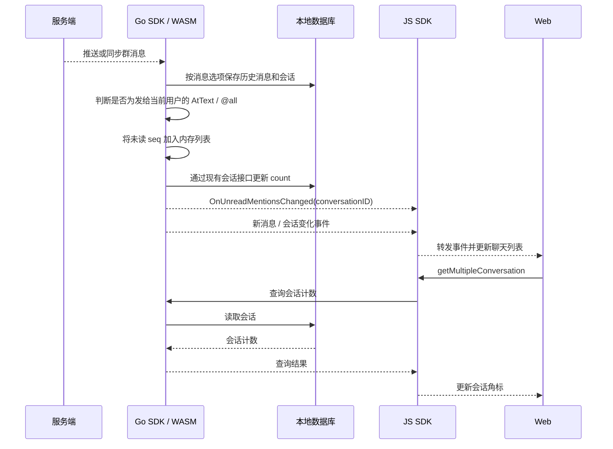
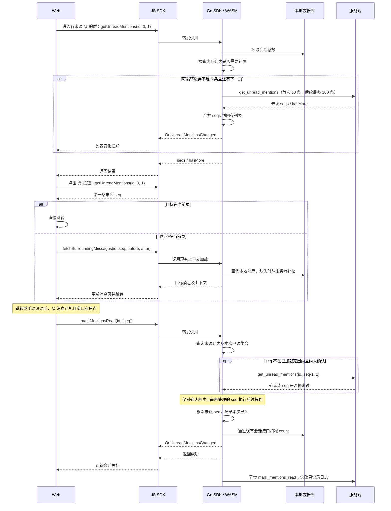

# 未读 @ 实现

优先用简单的数据模型实现当前功能。服务端只新增 `mention` 和 `mention_user`，不保存用户会话提及水位，不复制消息正文。

## 存储

| 集合           | 字段                                                             | 含义                                      |
| -------------- | ---------------------------------------------------------------- | ----------------------------------------- |
| `mention`      | `conversation_id, seq, send_id, send_time, at_all, is_deleted`   | 一条 @ 消息一行，保存消息位置和全局有效性 |
| `mention_user` | `user_id, conversation_id, seq, is_read, create_time, read_time` | 明确 @ 的目标用户，或任意用户的已读记录   |

两表均由 MongoDB 自动生成 `_id`。`mention` 按 `(conversation_id, seq)` 唯一，`mention_user` 按 `(user_id, conversation_id, seq)` 唯一，写入均为幂等 upsert。

`send_id` 用于排除发送者，`send_time` 用于排除入群前的提醒。查询同时遵守现有会话、用户和群的 minSeq/maxSeq 可见范围。用户未读数和普通 readSeq 独立维护。

## 写入与读取

- 每条 @ 消息写一条 `mention`。明确 @ K 人时再批量写 K 条 `mention_user`；`@all` 不展开群成员。
- 复用消息持久化消费链路建立服务端提及索引；SDK 从收到的正常消息中更新本地状态。
- 查询 `mention` 并关联当前用户的 `mention_user`：明确 @ 要求目标记录存在且未读，`@all` 要求不存在已读记录；同时排除发送者、撤回和不可见项。
- 未读 count 在查询时计算，不持久化，不另设 count 缓存。
- 撤回或全局删除将 `mention.is_deleted` 置为 true；用户单独删除将自己的 `mention_user.is_read` 置为 true。
- minSeq/maxSeq 变化只重算可见提及，不写已读记录。

## 接口

```text
GetUnreadMentions(conversationID, offsetSeq, limit)
MarkMentionsRead(conversationID, seqs)
MarkAllMentionsRead(conversationID)
```

会话和消息位置分别使用 `conversationID`、`seq`。

`GetUnreadMentions` 只返回 `seqs` 和 `hasMore`，两个写接口返回空响应。完成的 `seqs` 通过现有可靠通知链路同步到同一账号的其他端。普通 `PullMsgs` 不增加提及字段。

逐条已读批量 upsert `mention_user(is_read=true)`，不会推进普通 readSeq；已读记录可以先于异步提及落库。

全部已读由 controller 查询并完成**本次查询返回的可见未读提醒**，无需额外查询 maxSeq。它不保存覆盖未来补写提醒的水位；之后生成且未被逐条完成的提醒仍可显示。

`GetMentionStates` 是 SDK 内部批量查询会话 count 的接口，返回 `conversationID -> count`，不对应第三张状态表。

## 同步与离线

- 服务端从消息的 `AtUserIDList` 建立提及索引；SDK 从消息的 `AtTextElem.AtUserList` 更新本地提及。撤回和删除复用现有消息事件。已读通知携带 `conversationID` 和完成的 `seqs`。
- SDK 只在会话行保存 count，复用现有会话更新接口。未读 seq 列表、分页游标和本次同步以来已读的 seq 留在内存中；消息表不增加 @ 字段，也没有专用 @ 表、SQL 或数据库桥接。
- 消息对象不携带未读 @ 标志，消息转换保持原样。SDK 根据内存列表判断可见 seq 是否未读；不在已加载范围内的 seq，先查询服务端确认，再扣减计数。
- 重连时只从 `GetMentionStates` 同步总数并清除内存列表，不逐群拉取列表。活跃群有未读 @ 时才请求列表：首次拉 10 条，可供跳转的缓存不足 5 条且 `hasMore` 为 true 时补拉最多 100 条。每次只请求一页，不循环填满。5 是补页阈值。总数不按缓存长度重算。
- 预取只合并 seq，不查询、拉取或保存消息正文，也不更新消息行。新到的较大 seq 不会越过尚未加载的旧提醒成为跳转目标。同一会话的并发预取合并执行。
- `MarkMentionsRead` 对缓存中已确认未读的 seq 直接更新本地状态；未知 seq 先按 `offsetSeq=seq-1, limit=1` 确认。已读记录及已加载范围内不存在的 seq 不重复查询、不扣计数。确认失败保留原状态；确认期间发生全部已读或重连同步时，丢弃旧响应。
- 本地已读完成后异步调用写接口一次；写请求失败只记录日志，不保存待重试操作。
- 离线“全部已读”清除本地已知提醒；若服务端请求失败，其他设备可能仍显示未读，重连同步服务端总数时本机计数也可能重新出现。
- 提及或已读通知先于消息入库时，SDK 只更新内存列表和计数，与消息存储无关。已读集合过滤迟到的未读响应；全部已读或重连同步会使旧的在途分页失效。重启后内存列表按需重新加载。
- Web 点击 @ 按钮时取第一条未读 seq；当前页有该消息则直接跳转，否则用 `FetchSurroundingMessages` 拉取上下文。
- 点击跳转和手动滚动共用可见性检测：消息实际进入可视区域、当前聊天激活且窗口有焦点时，Web 将发给自己的 @ 消息 seq 交给 `MarkMentionsRead`。Web 不查询消息的未读 @ 状态，也不为刷新标志重新查询消息。未读总数稍后同步到达时，可见消息也会触发处理。

## 处理时序

### 收到新 @ 消息



### 进入群聊、跳转与已读



点击“全部标为已读”走 `markAllMentionsRead`：同样先更新本地，再异步请求服务端。重连只同步总数；只有进入有未读 @ 的群聊时才触发列表预取。

## 验证与发布

必须验证：2000 人群的 `@all` 只产生一条提及；用户完成状态互不影响；重复写入；完成先于提及落库；撤回、删除、入群时间及 minSeq/maxSeq；离线重启后按需加载列表；普通已读功能不受影响。

发布顺序：protocol → server → SDK Core/WASM/JS → Web。Web 当前通过本地链接使用 JS SDK，发布后换成正式依赖。
