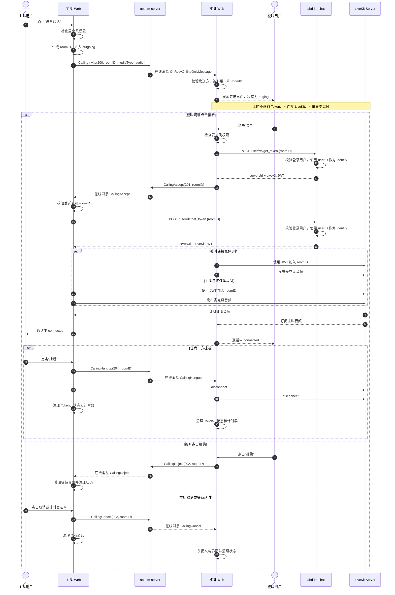

# 一对一音视频通话实施计划

## 1. 目标与范围

首期在 Web 客户端提供一对一视频通话和语音通话。双方在线时，用户可以在私聊中发起通话，对方可以接听、拒绝，任一方可以挂断。

语音和视频共用同一套 LiveKit 与呼叫信令，仅通过 `mediaType` 区分，因此建议同时实现。

首期不包含：

- 群组通话、屏幕共享和通话录制。
- 离线来电推送、未接来电记录和通话历史。
- 多设备抢占、占线状态和服务端通话状态持久化。

## 2. 整体方案

- `abd-im-server` 继续负责在线自定义消息，用于传递邀请、接听、拒绝和挂断等呼叫信令，首期无需新增接口。
- `abd-im-chat` 负责校验登录用户并签发 LiveKit 入房 Token。
- LiveKit Server 负责实际的麦克风、摄像头媒体传输。
- `abd-im-web` 负责通话入口、来电弹窗、设备权限和通话控制界面。

## 3. 需要修改的部分

### `abd-im-web`

现有 `RtcCallModal`、LiveKit 客户端和呼叫信令代码可以继续使用，主要改动如下：

- 将现有视频/语音通话菜单接入私聊头部，只在一对一会话显示。
- 调整获取 LiveKit Token 的请求，不再由客户端提交可伪造的用户 `identity`。
- 补充麦克风/摄像头无权限、LiveKit 连接失败和设备不可用的提示。
- 使用 `idle`、`ringing`、`outgoing`、`connecting`、`connected` 等明确状态管理一次通话。收到邀请只进入来电等待状态，接收方只有明确点击接听后才能获取入房凭证并连接 LiveKit。
- 所有信令同时校验发送方和 `roomID`，忽略旧通话、重复或乱序信令；在线呼叫信令通过 SDK 的 `OnRecvOnlineOnlyMessage` 事件接收。
- 拒绝、取消、挂断或关闭弹窗时清理入房凭证、连接状态和定时器，并使尚未完成的权限检查、Token 请求等异步操作失效。
- 检查重复来电、通话中再次来电、超时取消及断线关闭弹窗等状态。首期没有服务端占线模型时，客户端至少应忽略或拒绝通话中的新邀请。
- 保持语音通话默认不开启摄像头，视频通话默认开启摄像头和麦克风。
- 视频通话缺少摄像头或麦克风权限时终止本次呼叫，不自动降级为语音通话。

### `abd-im-chat`

现有 `/user/rtc/get_token` 路由和 LiveKit Token 生成逻辑可以保留，但需要加固：

- 从已验证的登录 Token 中取得当前用户 ID，并将其作为 LiveKit `identity`。
- 校验 `roomID` 非空，并限制其长度和格式。
- 每次请求独立创建 LiveKit AccessToken，设置较短有效期和仅加入指定房间的权限。
- LiveKit URL、API Key 和 Secret 通过部署配置或密钥管理注入，不使用仓库示例值。
- 为 Token 签发失败记录必要日志，但不记录 LiveKit Secret 或完整 Token。

### `abd-im-server`

首期不修改。现有自定义在线消息已能承载一对一呼叫信令。

如果后续增加离线来电、多端同步、通话记录或统一占线状态，再评估增加正式的服务端通话状态模型和离线推送能力。

### 部署

- 新增独立的 LiveKit Server 服务，配置与 `abd-im-chat` 一致的 API Key 和 Secret。
- 生产环境为 Web、业务 API 和 LiveKit 配置 HTTPS/WSS。
- 开放 LiveKit 所需 TCP/UDP 端口，并配置 TURN，保证严格 NAT 或受限网络下可连接。
- 不将 LiveKit API Secret 暴露给浏览器。

## 4. 必要接口与信令

### 获取入房凭证

`POST /user/rtc/get_token`

该接口使用现有业务登录 Token 鉴权。

请求：

```json
{
  "roomID": "call-uuid"
}
```

响应 `data`：

```json
{
  "serverUrl": "wss://rtc.example.com",
  "token": "livekit-jwt"
}
```

服务端必须使用当前登录用户 ID 生成 `identity`，客户端不能指定其他身份。

### 呼叫信令

继续通过 `abd-im-server` 的自定义在线消息发送，不新增 HTTP 接口。消息至少包含：

```json
{
  "customType": 200,
  "data": {
    "roomID": "call-uuid",
    "inviterUserID": "user-a",
    "inviteeUserIDList": ["user-b"],
    "mediaType": "video",
    "timeout": 60
  }
}
```

沿用现有类型：

| 类型  | 含义 |
| ----- | ---- |
| `200` | 邀请 |
| `201` | 接听 |
| `202` | 拒绝 |
| `203` | 取消 |
| `204` | 挂断 |

`mediaType` 取值为 `video` 或 `audio`。首期信令仍为在线消息，对方离线时呼叫失败或按超时结束。

邀请、接听、拒绝、取消和挂断信令都必须关联同一个 `roomID`。来电邀请本身不代表用户同意接听，接收方不能因为收到邀请、提前取得 Token 或残留的上一通状态而自动入房。

## 5. 语音通话时序

视频通话使用相同流程，仅将 `mediaType` 改为 `video`，并在接听前同时检查摄像头和麦克风权限。



## 6. 实施顺序

1. 部署并配置 LiveKit，验证两名测试用户可以使用签发的 Token 加入同一房间。
2. 加固 `abd-im-chat` Token 接口并更新 Web 请求结构。
3. 接通私聊中的视频/语音入口，完善显式接听、权限、失败、超时和状态清理。
4. 使用两台设备完成视频、语音、拒绝、取消、挂断和断网测试；同一台电脑双开测试时注意两个客户端可能抢占同一个摄像头。

## 7. 验收条件

- 私聊用户可以发起视频或语音通话，对方可以接听、拒绝，双方均可挂断。
- 接收方未点击接听时不得获取媒体或连接 LiveKit；上一通的 Token、定时器和信令不得使下一通自动接听。
- 旧 `roomID`、非当前对端和重复信令不会改变当前通话状态；通话中再次收到邀请时不会覆盖当前通话。
- 语音通话不采集或发布视频；视频通话可分别关闭麦克风和摄像头。
- 视频通话没有摄像头或麦克风权限、设备不可用或被占用时明确失败，不自动降级为语音。
- 未授权用户不能为其他用户签发 LiveKit Token，也不能加入非指定房间。
- 摄像头/麦克风拒绝授权、对方不在线、连接失败和呼叫超时均有明确结果。
- 在 HTTPS/WSS 的生产部署方式下，至少完成一次不同网络设备间的通话验证。
